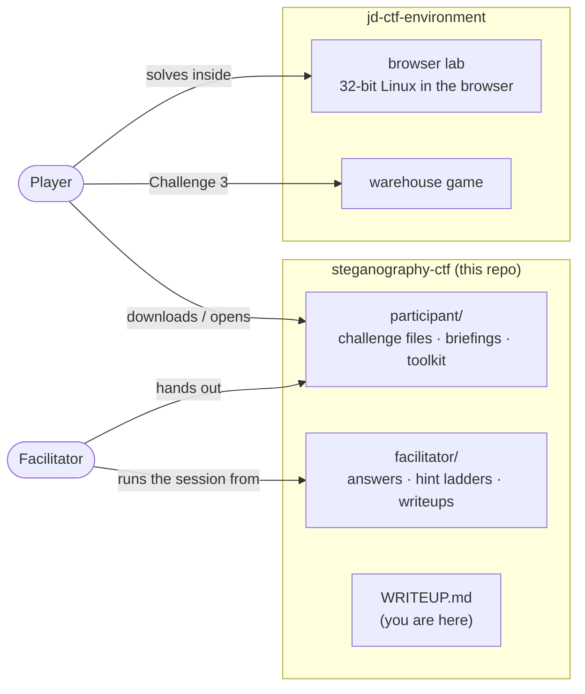
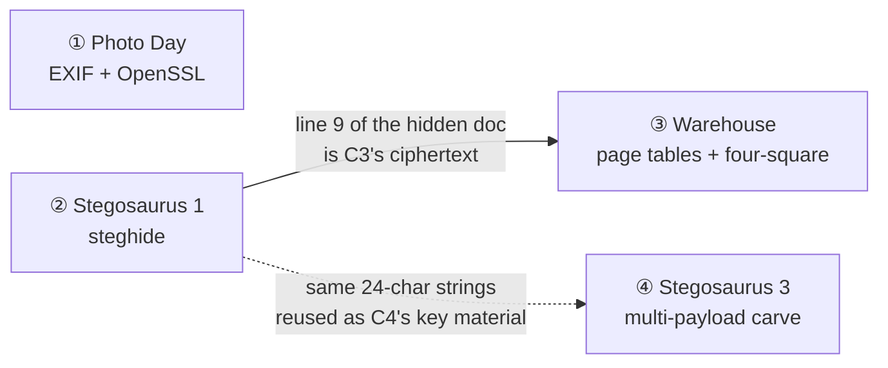
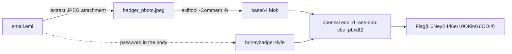
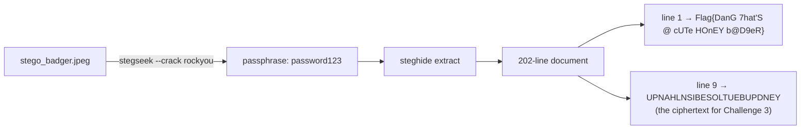
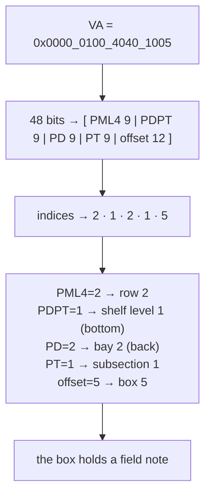
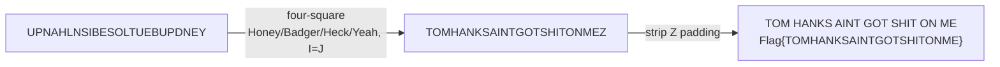
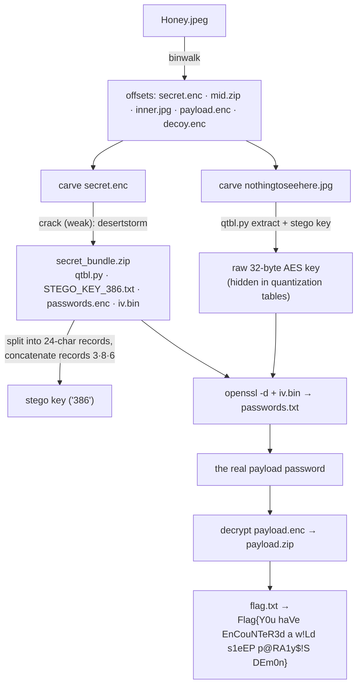

# Steganography CTF — The Full Writeup

> ### ⚠️ Total spoilers ahead
> This document explains **every** challenge end to end, including the flags. It's the "behind the
> scenes" tour — how the puzzles work, why they're built the way they are, and how the whole thing
> fits together. If you want to *play*, stop here and grab [`participant/`](participant/) instead.

A four-challenge capture-the-flag built around one running joke: a military signals unit that is
extremely good at hiding things and extremely bad at keeping secrets. You'll pull ciphertext out of
photo metadata, crack a hidden message, walk a virtual address through a warehouse like a CPU walks
page tables, and peel a single JPEG apart into five stacked payloads. Every flag looks like
`Flag{…}`.

Everything is author-created and author-owned; it runs entirely on supplied local files. See
[`facilitator/ACADEMIC_USE.md`](facilitator/ACADEMIC_USE.md).

---

## How it all fits together

The project is split across two repositories: **this one** is the challenges and their
documentation; the **[jd-ctf-environment](https://github.com/jdtherobot/jd-ctf-environment)** repo is
where you actually run them (an in-browser 32-bit Linux lab and the warehouse game).



The design is deliberately **two-sided**. A *facilitator* hands players the spoiler-free
`participant/` folder and drives the session from `facilitator/` — releasing hints in stages,
troubleshooting dead ends, and checking answers. Everything a player needs to *do* the challenges,
they can do with standard local tools or inside the browser lab.

### Challenge order

The four are mostly independent, with one hard dependency and one wink:



**Solve 2 before 3** — Challenge 3's cipher input is literally line 9 of the document you recover in
Challenge 2. Challenge 4 is self-contained but quietly reuses Challenge 2's strings as key material,
tying the set together.

---

## Challenge 1 — Photo Day lvl 2

**Theme.** An intercepted email from "Secretary of Watermelon" to "Mr. Tema" at `military.signal`,
gushing about the squadron's shiny new *256-bit AES*. Attached: a badger photo. The gag: they
encrypted the flag properly… then wrote the password directly in the email body ("Definitely not the
password: …").

**The mechanics.** The flag was encrypted with OpenSSL and the ciphertext tucked into the JPEG's EXIF
`Comment` field as base64. So the solve is: parse the email, pull the attachment, read the EXIF
comment, and decrypt with the password hiding in plain sight.



```bash
exiftool -Comment -b attachment.jpeg > c.b64
openssl enc -aes-256-cbc -d -pbkdf2 -k honeybadger4lyfe -a -in c.b64
# → Flag{H0NeyB4d6er10OKinG0OD!!!}
```

**The lesson.** Metadata is data. `exiftool` on anything interesting is free reconnaissance — and a
"secure" pipeline is only as strong as the human who narrates the password into the transcript.

---

## Challenge 2 — Stegosaurus 1

**Theme.** A second badger photo, this time with a genuinely hidden file embedded by **steghide**.
The passphrase is weak on purpose — the challenge is really about knowing that images can carry
password-protected payloads and reaching for a wordlist.

**The mechanics.** `stegseek` (or `stegcracker`) rips through `rockyou` and finds the passphrase
almost instantly; `steghide extract` then pulls out a 202-line document. Line 1 is the flag. Lines
2–202 are decoy 24-character strings — except they're not *all* decoys.



**The twist.** **Line 9** of that document is the four-square ciphertext you'll need in Challenge 3,
and the whole 201-string block reappears as the key material behind Challenge 4. What looks like
noise is load-bearing.

**The lesson.** When a stego payload is *mostly* junk, ask what the junk is for. Here it's a
one-time pad of red herrings with two real needles in it.

---

## Challenge 3 — Stegosaurus 2: the Memory Warehouse

The centerpiece, and the reason there's a warehouse game. You play a CPU's memory-management unit:
your TLB is empty, so you must **walk a page table** to resolve a virtual address into a physical
location — except "physical memory" is a warehouse, and the "physical address" is a shelf you walk
to and read a note off of.

**The walk.** A 48-bit x86-64 virtual address splits into four 9-bit table indices and a 12-bit
offset. The warehouse is organized to match, one-to-one:



**The note.** At Row 2 · Shelf 1 · Bay 2 · Subsection 1 · Box 5, you find a hand-drawn card:

```
   Honey            Badger
          dCode
         ▢ ▢ ▢ ▢
         Line #9
   Heck              Yeah
```

Four corner keywords, a nod to the **four-square cipher** (via dCode), and a pointer back to **line 9
of the Challenge 2 document**.

**The cipher.** The four-square is set up with all four 5×5 squares keyed — corner word to corner
square exactly as printed (`HONEY`/`BADGER`/`HECK`/`YEAH`), I and J merged. Decoding line 9:



> *Reconstruction note:* the archive's Challenge 3 folder was empty — no flag file survived. The
> plaintext `TOMHANKSAINTGOTSHITONME` is verified ground truth (it's the unique four-square decode of
> the surviving ciphertext, confirmed by an exhaustive 2,401-configuration search), so
> `Flag{TOMHANKSAINTGOTSHITONME}` is a documented reconstructed default in the `Flag{…}` house style.

**The game.** In the original run this was a real, physical warehouse. The
[warehouse game](https://github.com/jdtherobot/jd-ctf-environment) recreates it: a top-down space of
10 rows × 3 shelf levels × 2 bays × 8 subsections × 7 boxes (3,360 locations). Every wrong box says
"Nothing here"; the one correct box hands you the field note. It's an immersion layer, not a lock —
the coordinates live in shipped JavaScript — so the *real* gate is understanding the page-table walk.

**The lesson.** Computer-architecture fluency, disguised as a scavenger hunt. If you've ever drawn a
four-level page-table walk on a whiteboard, you already knew where the box was.

---

## Challenge 4 — Stegosaurus 3

The boss. One file — `Honey.jpeg` — that is secretly **five files stacked together**, wrapped in
three layers of encryption, with a stego-hidden key and a couple of decoys thrown in to waste your
time.

**The mechanics.** `binwalk` reveals the seams. You carve the pieces apart, crack the *weak* outer
layer to recover a toolkit, use that toolkit to extract an AES key hidden in a JPEG's **quantization
tables**, and use *that* to unwind the inner layers to the flag.



**The clever bit.** `STEGO_KEY_386.txt` *looks* like a wall of 4,824 characters. The `386` in the
filename is the instruction: split it into 24-character records and concatenate records **3, 8, 6**
to build the XOR key that `qtbl.py` needs. (Those 24-char records? They're the same 201 decoy strings
from Challenge 2 — the noise from earlier was the key all along.) The AES key itself never appears in
the bundle; it lives only in the low bits of the inner JPEG's quantization tables, extractable only
with the derived key.

**The decoys.** `mid.zip` opens to a four-square red herring; `decoy_random.enc` is literally random
bytes; a stray `secret.txt` reads "better luck next time." Part of the challenge is *not* chasing them.

**The lesson.** Real forensics is layered, and progress on one layer unlocks the tools for the next.
It also rewards reading filenames like clues — because here, one of them literally is.

---

## The two sides, in practice

**Player side (`participant/`)** — four challenge folders, each with a spoiler-free `BRIEF.md` and the
file(s) you need, plus a `PLAYER_TOOLKIT.md` that checks you have `exiftool`, `openssl`, `binwalk`,
`steghide`, `python3`, and friends. You can work on your own machine or inside the browser lab, which
ships the same files and tools pre-installed.

**Facilitator side (`facilitator/`)** — for each challenge: a full `WRITEUP.md`, a **staged hint
ladder** (nudges that escalate from "have you looked at the metadata?" to the exact command), the
deterministic `rebuild.sh` that regenerates the distributable, and an automated `solve_test.sh` that
solves from the player files and asserts the exact flag. Plus room/setup notes and troubleshooting
for the classic failure modes ("nothing found", "bad decrypt", "wrong carve offset").

---

## How it was built

These challenges were **reconstructed** from an original event's working archive — a messy pile of
finished files, intermediate builds, duplicate folders, and conflicting revisions. The reconstruction
treated that archive as immutable evidence:

- **Inventory & canonicalize.** Every one of ~280 archived files was hashed; byte-identical duplicates
  were grouped; conflicting revisions were compared by *solvability*, not by which looked newest. Each
  chosen file is traced back to its archive path + SHA-256 in
  [`facilitator/ARCHIVE_PROVENANCE.md`](facilitator/ARCHIVE_PROVENANCE.md), with every rejected
  revision and the reason it was rejected.
- **Repair, don't fake.** Challenge 4's original had three real authoring bugs (a key-order/filename
  mismatch, an uncrackable "weak" password, and a stray byte gap that broke carving). A corrected v3
  was rebuilt outside the archive and re-validated end to end.
- **Prove it.** Every challenge has an automated solver test; all four pass from the player files
  alone. A secret-scan gate guarantees no flag or creator-only key leaks into `participant/`, and an
  archive-fingerprint check guarantees the original evidence was never modified. Results:
  [`facilitator/VALIDATION_REPORT.md`](facilitator/VALIDATION_REPORT.md).
- **Make it playable anywhere.** The
  [environment repo](https://github.com/jdtherobot/jd-ctf-environment) hosts a client-side 32-bit
  Linux lab (v86) so a player can solve everything in a browser tab — no install — plus the warehouse
  game. The toolchain was proven by solving Challenges 2 and 4 inside a real 32-bit container.

---

## Links

- **Play it:** [`participant/`](participant/) · **Run it in the browser / warehouse game:**
  [jd-ctf-environment](https://github.com/jdtherobot/jd-ctf-environment)
- **Answers & facilitation:** [`facilitator/`](facilitator/)
- **Provenance & validation:** [`facilitator/ARCHIVE_PROVENANCE.md`](facilitator/ARCHIVE_PROVENANCE.md)
  · [`facilitator/VALIDATION_REPORT.md`](facilitator/VALIDATION_REPORT.md)
