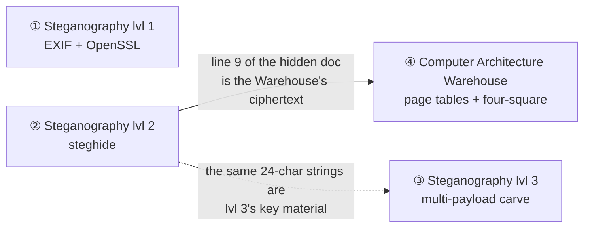

# Steganography CTF — The Full Writeup

> ### ⚠️ Total spoilers ahead
> This explains **every** challenge end to end, including the flags. To *play*, stop here and
> grab [`participant/`](participant/) instead.

A four-challenge CTF built around a running joke: a signals unit that is very good at hiding
things and very bad at keeping secrets. You pull ciphertext out of a photo's metadata, crack a
hidden message, take apart one JPEG that is secretly several files, and — for the real nerds —
walk a virtual address through the page tables to a physical box in a warehouse. Every flag
looks like `Flag{…}`.

## How it fits together

Players get the spoiler-free `participant/` folder; the facilitator runs the session from
`facilitator/` (flags, walkthroughs, setup, the printable warehouse note, solver tests). The
challenges are mostly independent, with one hard dependency and one quiet reuse:



**Solve lvl 2 before the Warehouse.** And a player who keeps the document from lvl 2 is
already holding key material for lvl 3.

---

## ① Steganography lvl 1

An intercepted email from the *"Secretary of Watermelon"* to *"Mr. Tema,"* gushing about the
squadron's shiny new 256-bit AES. Attached: a badger photo. The gag — they encrypted the flag
properly, then wrote the password directly in the email body (*"Definitely not the password:
honeybadger4lyfe"*). The flag is an OpenSSL blob tucked in the JPEG's EXIF `Comment`; read the
comment, decrypt with the leaked password.

```
exiftool -b -Comment badger_photo.jpeg | openssl enc -aes-256-cbc -d -pbkdf2 -a -k honeybadger4lyfe
→ Flag{H0NeyB4d6er10OKinG0OD!!!}
```

## ② Steganography lvl 2

A second badger photo with a file embedded by **steghide** behind a weak passphrase. Crack it
with a wordlist (`password123`), extract, and the flag is line 1 of a 202-line document. The
rest of that document is not just noise — line 9 is the Warehouse's ciphertext, and its 201
filler strings are lvl 3's key material.

```
stegcracker stego_badger.jpeg rockyou.txt   →  password123
steghide extract -sf stego_badger.jpeg -p password123 -xf doc.txt   →  line 1: Flag{DanG 7hat'S @ cUTe HOnEY b@D9eR}
```

## ③ Steganography lvl 3

One JPEG — `Honey.jpeg` — that is secretly several files stacked together, wrapped in layers
of encryption, with a stego-hidden AES key and a couple of decoys. `binwalk` reveals the
seams; you carve the pieces, open a weakly-encrypted bundle, use its helper to pull an AES key
hidden in a JPEG's **quantization tables**, and unwind the inner layers to the flag.

The weak layer is *not* a wordlist crack — it's a **reasoning** puzzle. The challenge's own
narration (a tale about *"John,"* from the Desert Storm days, and his friends *Aho, Weinberger,
and Kernighan* → `awk`) teaches you to *build* the password: a codename, a `#`, two digits, and
a three-letter mixed-case tag — mask `?d?d?l?u?l`.

*(Full carve-and-decrypt chain and the exact flag are in the facilitator writeup; the whole
chain is verified end-to-end against the author's original carrier.)*

## ④ Computer Architecture Warehouse

You are the MMU. Your TLB is empty, so you must walk a page table to resolve
`VA = 0x0000_0100_4040_1005` into a physical box in a memory warehouse. Split the low 48 bits
into `[PML4 9][PDPT 9][PD 9][PT 9][OFFSET 12]` → `2·1·2·1·5` → Row 2 / Shelf 1 / Section 2 /
Sub-section 1 / Box 5. In the box is a hand-drawn note: four corner words (Honey / Badger /
Heck / Yeah), *"dCode ▢▢▢▢"*, and *"Line #9."* That's a **four-square cipher** (all four squares
keyed) applied to line 9 of the lvl-2 document:

```
UPNAHLNSIBESOLTUEBUPDNEY  →  TOMHANKSAINTGOTSHITONME(Z)  →  Flag{TOMHANKSAINTGOTSHITONME}
```

In person, the note sits in the correct box; remotely, the companion warehouse game recreates
the space. The coordinates live in the layout — the real gate is doing the page-table walk.

---

## Running it

Hand out `participant/`; drive the session from `facilitator/`. Release the optional hints (lvl 2
and the Warehouse each ship two, in order) if a team stalls. Every challenge has a `solve_test.sh` that solves
from the player files and asserts the flag, so you can prove the set works before the event.
